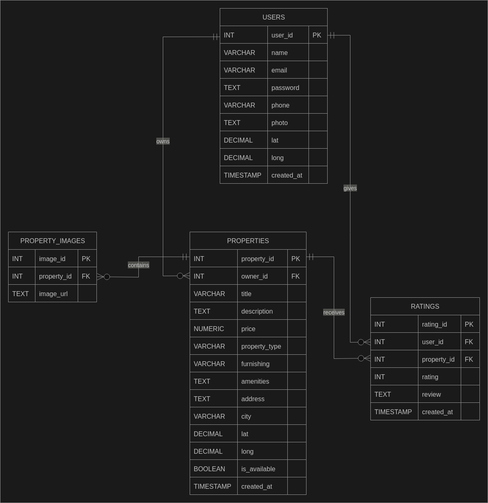
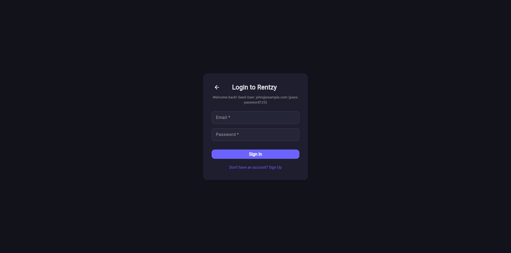
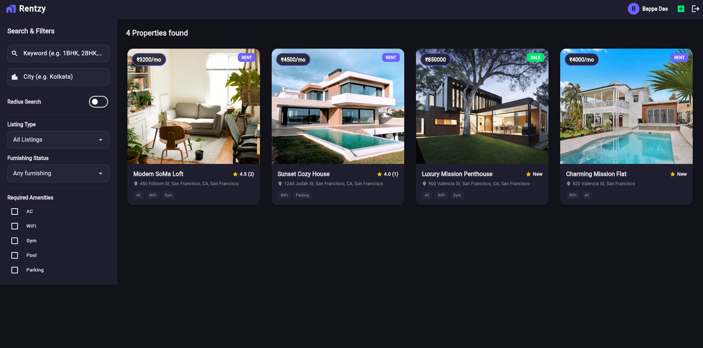
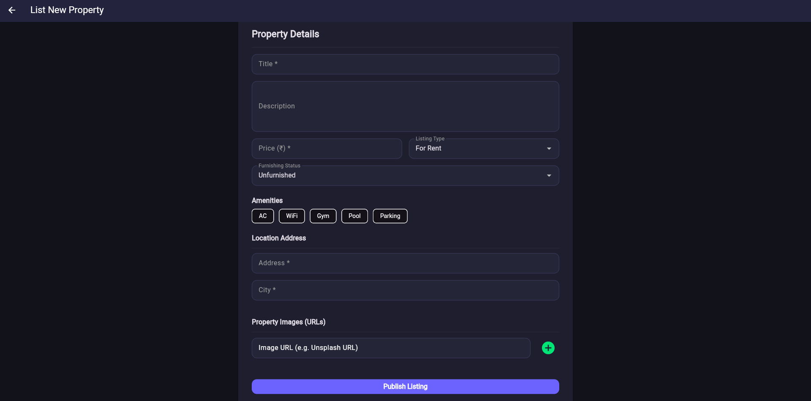
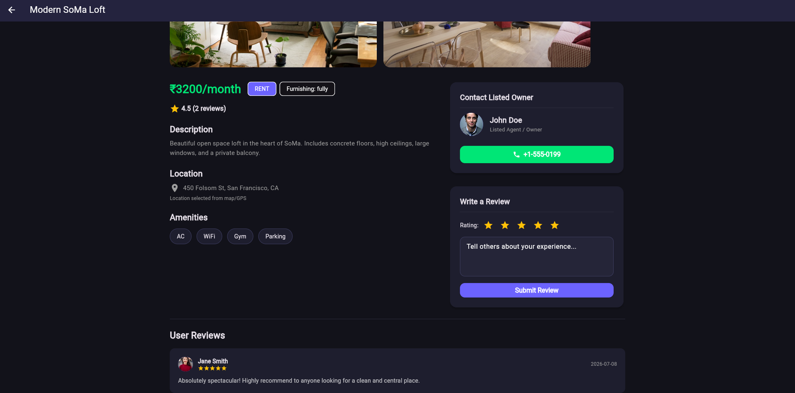

# Rentzy - Smart Rental Property Management System

### DBMS Project Documentation
### Academic Project Coursework

This documentation serves as the comprehensive guide, requirements analysis, database schema definition, and system architecture report for the Rentzy Smart Rental Property Management System.

---

# 1. Problem Definition

## 1.1 Background Context

The traditional property rental process in India remains highly fragmented and inefficient. Tenants typically rely on brokers, social media groups, classified advertisements, or multiple property listing websites to search for rental accommodations.

Similarly, property owners often struggle to advertise their properties effectively and communicate with potential tenants without depending on intermediaries.

The absence of a centralized and easy-to-use rental platform results in poor user experience, delayed communication, and inefficient property management.

---

## 1.2 Identified Pain Points

### Fragmented Property Listings
Users are required to search through multiple websites and brokers to find suitable properties.

### Lack of Advanced Filtering
Many small-scale rental systems do not support filtering by furnishing status, amenities, property type, or city.

### Difficult Owner Communication
Tenants often depend on brokers to communicate with property owners which increases cost and delays responses.

### Poor Review Transparency
Users have no reliable method of verifying previous tenant experiences with a property.

### Manual Property Management
Property owners struggle to manage listings, images, and availability efficiently.

---

## 1.3 Proposed Solution: Rentzy

Rentzy is a modern database-driven property rental platform built using Flutter, Dart REST APIs, and PostgreSQL.

The system solves the above problems by:

1. Providing centralized property discovery.
2. Allowing owners to list properties directly.
3. Supporting filtering using multiple criteria.
4. Providing direct communication with owners.
5. Allowing tenants to submit ratings and reviews.
6. Managing property images and amenities efficiently.

---

# 2. Data Collection (Database Schema and Dictionary)

The Rentzy database consists of four highly relational entities.

---

# 2.1 Table: USERS

Stores all registered platform users including property owners and tenants.

| Field Name | Data Type | Key | Null | Description |
|-----------|-----------|-----|------|------------|
| user_id | INT | PK | NO | Unique user identifier |
| name | VARCHAR(255) | - | NO | User full name |
| email | VARCHAR(255) | UNI | NO | User email address |
| password | TEXT | - | NO | Encrypted password |
| phone | VARCHAR(50) | - | YES | User contact number |
| photo | TEXT | - | YES | Profile image URL |
| created_at | TIMESTAMP | - | NO | Registration timestamp |

---

# 2.2 Table: PROPERTIES

Stores all rental and sale property information.

| Field Name | Data Type | Key | Null | Description |
|-----------|-----------|-----|------|------------|
| property_id | INT | PK | NO | Unique property identifier |
| owner_id | INT | FK | NO | References USERS(user_id) |
| title | VARCHAR(255) | - | NO | Property title |
| description | TEXT | - | YES | Property description |
| price | NUMERIC(12,2) | - | NO | Property price |
| property_type | VARCHAR(50) | - | NO | rent or sale |
| furnishing | VARCHAR(50) | - | YES | fully, semi or unfurnished |
| amenities | TEXT | - | YES | Property amenities |
| address | TEXT | - | NO | Property address |
| city | VARCHAR(100) | - | NO | Property city |
| is_available | BOOLEAN | - | NO | Listing status |
| created_at | TIMESTAMP | - | NO | Listing creation date |

---

# 2.3 Table: PROPERTY_IMAGES

Stores all images associated with properties.

| Field Name | Data Type | Key | Null | Description |
|-----------|-----------|-----|------|------------|
| image_id | INT | PK | NO | Image identifier |
| property_id | INT | FK | NO | References PROPERTIES(property_id) |
| image_url | TEXT | - | NO | Image URL |

---

# 2.4 Table: RATINGS

Stores ratings and reviews submitted by users.

| Field Name | Data Type | Key | Null | Description |
|-----------|-----------|-----|------|------------|
| rating_id | INT | PK | NO | Rating identifier |
| user_id | INT | FK | NO | References USERS(user_id) |
| property_id | INT | FK | NO | References PROPERTIES(property_id) |
| rating | INT | - | NO | Rating value (1-5) |
| review | TEXT | - | YES | User review |
| created_at | TIMESTAMP | - | NO | Review timestamp |

---

# 3. System Requirements Analysis

## 3.1 Functional Requirements (FR)

### A. User Authentication Module

- User Registration
- User Login
- Session Management

---

### B. Property Listing Module

- Create Property Listings
- Edit Property Information
- Upload Property Images
- Add Amenities
- Update Availability Status

---

### C. Search and Filtering Module

The application supports:

- Keyword Search
- City Search
- Listing Type Filter
- Furnishing Filter
- Amenities Filter
- Radius Search

Examples:

- Keyword: `1BHK`
- Keyword: `2BHK`
- City: `Kolkata`

---

### D. Property Details Module

Displays:

- Property Images
- Description
- Price Information
- Amenities
- Owner Information
- User Reviews

---

### E. Review Module

Users can:

- Submit Ratings
- Write Reviews
- View Existing Reviews
- View Average Ratings

---

### F. Owner Contact Module

Instead of implementing internal messaging, Rentzy allows direct communication between tenants and owners through phone numbers.

This significantly simplifies the system architecture while improving usability.

---

## 3.2 Non Functional Requirements (NFR)

### Performance
The system should return search results with minimal latency.

### Scalability
The relational database structure allows efficient scaling to thousands of listings.

### Security
Passwords are stored as encrypted hashes.

### Availability
The application should maintain high uptime and consistent API response times.

### Usability
The interface follows modern UI practices to improve user experience.

---

# 4. Entity Relationship Diagram

## 4.1 Logical ER Diagram (Mermaid)
Below is the logical structure mapping relationships and cardinality (e.g., $1$ to many $N$, nullable
relationships):

```
erDiagram

USERS ||--o{ PROPERTIES : owns
USERS ||--o{ RATINGS : gives

PROPERTIES ||--o{ PROPERTY_IMAGES : contains
PROPERTIES ||--o{ RATINGS : receives

USERS {
    int user_id PK
    varchar name
    varchar email
    text password
    varchar phone
    text photo
    timestamp created_at
}

PROPERTIES {
    int property_id PK
    int owner_id FK
    varchar title
    text description
    numeric price
    varchar property_type
    varchar furnishing
    text amenities
    text address
    varchar city
    boolean is_available
    timestamp created_at
}

PROPERTY_IMAGES {
    int image_id PK
    int property_id FK
    text image_url
}

RATINGS {
    int rating_id PK
    int user_id FK
    int property_id FK
    int rating
    text review
    timestamp created_at
}
```

---

## 4.2 Conceptual Database Diagram

The conceptual database design is shown in the ER diagram attached with this documentation.


---

# 5. System Screenshots (User Interface Walkthrough)

---

## 5.1 Login Screen

The login screen allows existing users to authenticate into the system using email and password credentials.

Features:

- Email Authentication
- Password Authentication
- Sign Up Navigation
- Dark Theme User Interface

---

## 5.2 Property Search Dashboard

Displays all available properties and provides advanced filtering functionality.

Features:
- Keyword Search
- City Search
- Radius Search
- Listing Type Filter
- Furnishing Filter
- Amenities Filter

The dashboard displays property cards containing:
- Property Image
- Price
- Property Type
- Amenities
- Ratings


---

## 5.3 Property Listing Screen

Allows owners to publish new properties.

Features:

- Property Information Entry
- Furnishing Selection
- Amenities Selection
- Address Entry
- Image Upload URLs



---

## 5.4 Property Details Screen

Displays complete information about a selected property.

Features:

- Property Gallery
- Price Display
- Description
- Amenities
- Owner Contact Information
- Reviews and Ratings

In Review System

Users can provide:

- Star Ratings
- Written Reviews
- Feedback History

The average property rating is calculated automatically.



---

# 6. Future Scope

Potential future enhancements include:

- AI Property Recommendation System
- Online Rent Payment Integration
- Property Booking Requests
- Broker Verification System
- Property Analytics Dashboard
- Map Based Property Discovery

---

# 7. Conclusion

Rentzy provides a scalable and modern rental property management platform tailored specifically for Indian users.

The application combines efficient database design, intuitive user interfaces, and direct owner communication to simplify the rental experience for both tenants and property owners.